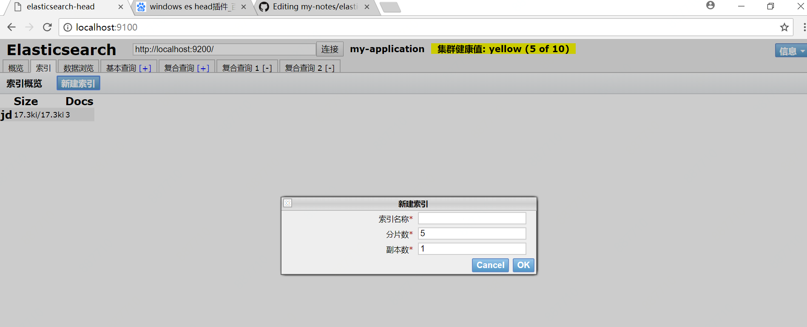
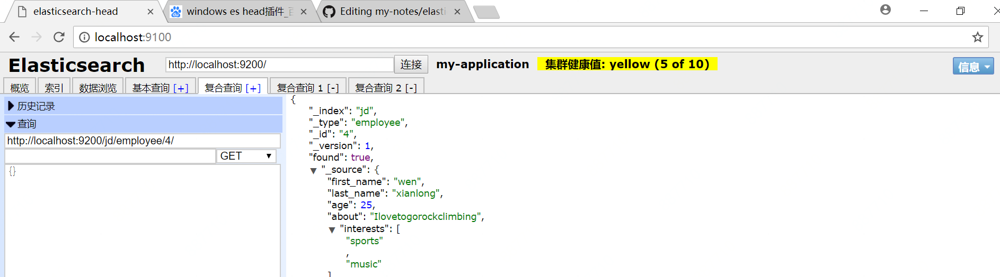
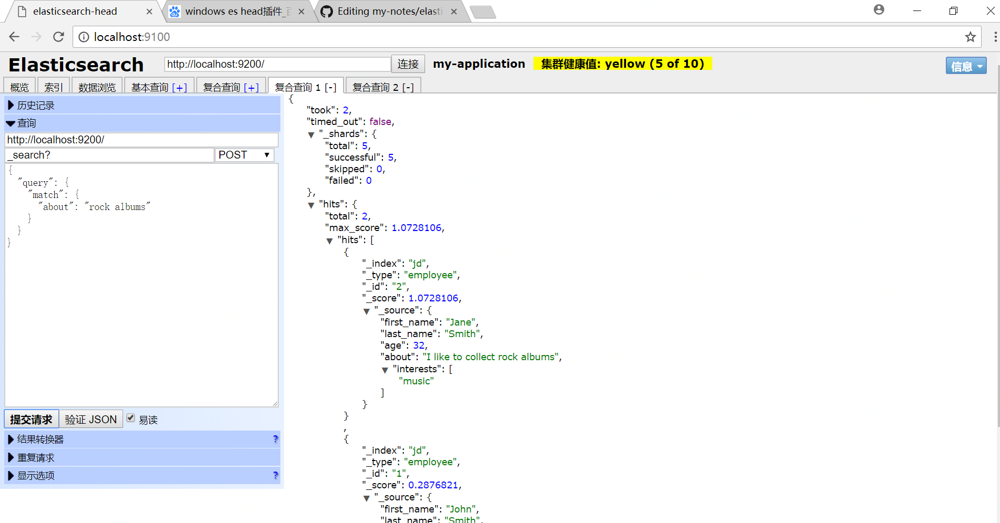
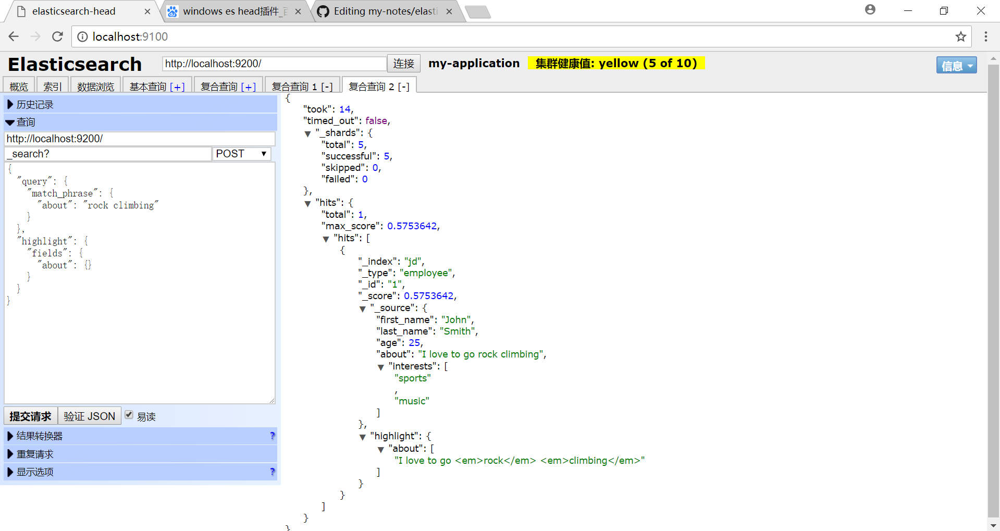

## Elasticsearch 是一个实时的分布式搜索分析引擎， 它能让你以一个之前从未有过的速度和规模，去探索你的数据。 它被用作全文检索、结构化搜索、分析以及这三个功能的组合

## 下载与运行
### 下载
安装 Elasticsearch 之前，你需要先安装一个较新的版本的 Java，最好的选择是，你可以从[www.java.com](www.java.com)获得官方提供的最新版本的 Java。
之后，你可以从 elastic 的官网 [elastic.co/downloads/elasticsearch](elastic.co/downloads/elasticsearch)获取最新版本的 Elasticsearch。
### 运行  
如果你是在 Windows 上面运行 Elasticseach，你应该运行 ```bin\elasticsearch.bat``` 而不是 ```bin\elasticsearch```  
启动成功后，访问[http://localhost:9200](http://localhost:9200),如果出现以下代码说明启动成功  
```
{
  "name" : "-mCUePm",
  "cluster_name" : "elasticsearch",
  "cluster_uuid" : "yRUkqtbUTaCcetsaY62wJg",
  "version" : {
    "number" : "6.2.4",
    "build_hash" : "ccec39f",
    "build_date" : "2018-04-12T20:37:28.497551Z",
    "build_snapshot" : false,
    "lucene_version" : "7.2.1",
    "minimum_wire_compatibility_version" : "5.6.0",
    "minimum_index_compatibility_version" : "5.0.0"
  },
  "tagline" : "You Know, for Search"
}

```

## 下载es-head插件  
1.安装git，下载[elasticsearch-head](git://github.com/mobz/elasticsearch-head.git)  
2.安装node,网址：[https://nodejs.org/en/download/ ](https://nodejs.org/en/download/)  
3.安装grunt    
   grunt是一个很方便的构建工具，可以进行打包压缩、测试、执行等工作，6.0里的插件就是通过grunt启动的
   * 安装grunt命令行工具 grunt-cli
   ```
   npm install -g grunt-cli
   
   ```
   * 安装grunt及其插件
   ```
   npm install grunt --save-dev
   
   ```
   * 检查是否安装成功
   ```
   grunt version
   
   ```
4.修改head源码
   * 修改服务器监听地址，文件为 ``` elasticsearch-head/Gruntfile.js ```  增加hostname属性，设置为 hostname: ‘*’,如下图所示
   
   * 修改head的连接地址， 文件为 ``` elasticsearch-head/_site/app.js ``` ,如下图所示
     
   
5.安装完成启动head 

    * 首先启动es  
    
    * 在head目录中，执行 npm install下载依赖包
    
       ```
       1. npm install
       
       2.进入elasticsearch-head目录启动node.js
   
        grunt server
     
        ```
        
     * 访问地址：ip:9100就可以访问head插件了

## 创建索引



## 添加数据

```
PUT http://localhost:9200/jd/employee/4/
{
  "first_name": "wen",
  "last_name": "xianlong",
  "age": 25,
  "about": "Ilovetogorockclimbing",
  "interests": [
    "sports",
    "music"
  ]
}

```


## 检索文档
* 检索单个文档

```
GET http://localhost:9200/jd/employee/4/

```


* 检索所有  

```
GET /megacorp/employee/_search
{
   "took":      6,
   "timed_out": false,
   "_shards": { ... },
   "hits": {
      "total":      3,
      "max_score":  1,
      "hits": [
         {
            "_index":         "megacorp",
            "_type":          "employee",
            "_id":            "3",
            "_score":         1,
            "_source": {
               "first_name":  "Douglas",
               "last_name":   "Fir",
               "age":         35,
               "about":       "I like to build cabinets",
               "interests": [ "forestry" ]
            }
         },
         {
            "_index":         "megacorp",
            "_type":          "employee",
            "_id":            "1",
            "_score":         1,
            "_source": {
               "first_name":  "John",
               "last_name":   "Smith",
               "age":         25,
               "about":       "I love to go rock climbing",
               "interests": [ "sports", "music" ]
            }
         },
         {
            "_index":         "megacorp",
            "_type":          "employee",
            "_id":            "2",
            "_score":         1,
            "_source": {
               "first_name":  "Jane",
               "last_name":   "Smith",
               "age":         32,
               "about":       "I like to collect rock albums",
               "interests": [ "music" ]
            }
         }
      ]
   }
}

```

* 条件检索  

```
GET http://localhost:9200/_search?
{
  "query": {
    "match": {
      "about": "rock albums"
    }
  }
}

```


* 更复杂的搜索  
现在尝试下更复杂的搜索。 同样搜索姓氏为 Smith 的雇员，但这次我们只需要年龄大于 30 的。查询需要稍作调整，使用过滤器 filter ，它支持高效地执行一个结构化查询
```
GET /megacorp/employee/_search
{
    "query" : {
        "bool": {
            "must": {
                "match" : {
                    "last_name" : "smith" 
                }
            },
            "filter": {
                "range" : {
                    "age" : { "gt" : 30 } 
                }
            }
        }
    }
}

```
* 短语检索
找出一个属性中的独立单词是没有问题的，但有时候想要精确匹配一系列单词或者短语 。 比如， 我们想执行这样一个查询，仅匹配同时包含 “rock” 和 “climbing” ，并且 二者以短语 “rock climbing” 的形式紧挨着的雇员记录。  
```
GET /megacorp/employee/_search
{
    "query" : {
        "match_phrase" : {
            "about" : "rock climbing"
        }
    }
}

```

* 高亮检索  
许多应用都倾向于在每个搜索结果中 高亮 部分文本片段，以便让用户知道为何该文档符合查询条件。在 Elasticsearch 中检索出高亮片段也很容易。 

```
GET http://localhost:9200/_search?
{
  "query": {
    "match_phrase": {
      "about": "rock climbing"
    }
  },
  "highlight": {
    "fields": {
      "about": {}
    }
  }
}
```



### 分析文档
Elasticsearch 有一个功能叫聚合（aggregations），允许我们基于数据生成一些精细的分析结果。聚合与 SQL 中的 GROUP BY 类似但更强大。
例如：  

```
GET /megacorp/employee/_search
{
    "aggs" : {
        "terms" : {
            "field" : "interests"
        }
    }
}
```
返回结果：  
```
{
   ...
   "hits": { ... },
   "aggregations": {
      "all_interests": {
         "buckets": [
            {
               "key":       "music",
               "doc_count": 2
            },
            {
               "key":       "forestry",
               "doc_count": 1
            },
            {
               "key":       "sports",
               "doc_count": 1
            }
         ]
      }
   }
}
```
可以看到，两位员工对音乐感兴趣，一位对林地感兴趣，一位对运动感兴趣。这些聚合并非预先统计，而是从匹配当前查询的文档中即时生成。如果想知道叫 Smith 的雇员中最受欢迎的兴趣爱好，可以直接添加适当的查询来组合查询：

```
GET /megacorp/employee/_search
{
    "query" : {
        "match" : {
            "last_name" : "Smith
         }
      },
      "aggs" : {
          "all_interests" : {
              "terms" : {
                  "field" : "interests"
              }
          }
      }
}
```
```all_interests``` 聚合已经变为只包含匹配查询的文档：  
```
...
  "all_interests": {
     "buckets": [
        {
           "key": "music",
           "doc_count": 2
        },
        {
           "key": "sports",
           "doc_count": 1
        }
     ]
  }
```
聚合还支持分级汇总 。比如，查询特定兴趣爱好员工的平均年龄： 
```
GET /megacorp/employee/_search
{
    "aggs" : {
        "all_interests" : {
            "terms" : { "field" : "interests" },
            "aggs" : {
                "avg_age" : {
                    "avg" : { "field" : "age" }
                }
            }
        }
    }
}
```
得到的聚合结果有点儿复杂，但理解起来还是很简单的：
```
...
  "all_interests": {
     "buckets": [
        {
           "key": "music",
           "doc_count": 2,
           "avg_age": {
              "value": 28.5
           }
        },
        {
           "key": "forestry",
           "doc_count": 1,
           "avg_age": {
              "value": 35
           }
        },
        {
           "key": "sports",
           "doc_count": 1,
           "avg_age": {
              "value": 25
           }
        }
     ]
  }
```


